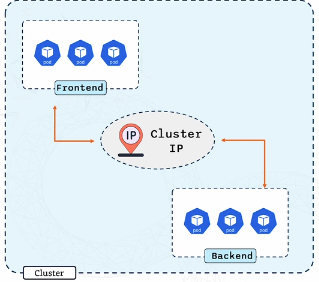
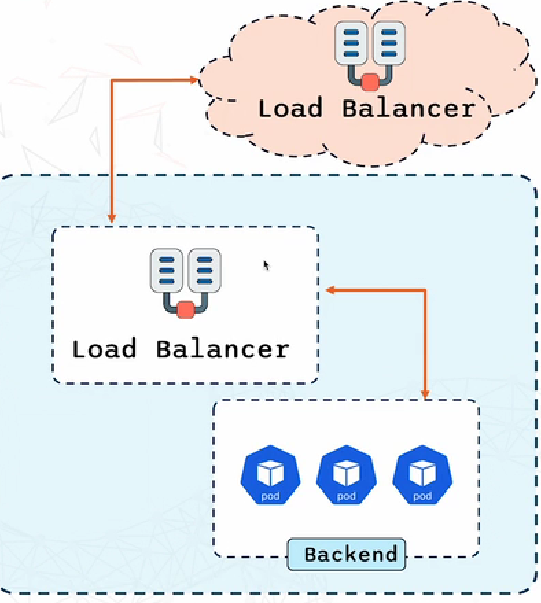

# **Different Service Types**

**Cluster IP**
---
- When you create a service with the type **Cluster IP**, Kubernetes gives it a **unique internal IP address** 

- This IP is only reachable within the cluster. 

**Why would you want to use it?**

- Service is only accessible within the cluster, it keeps your internal communication secure

- It's the default service type, just create your service and Kubernetes takes care of the rest.

**NodePort**
---
- A way to make your service accessible from **outside the Kubernetes cluster**

- With a Node Port service, Kubernetes opens a **specific port on each node in your cluster** and forwards traffic **from that port to your service** 

**How does it work**

- **NodePort (30080)** - The port opened on **every node,** used to access the app from outside the cluster, maps to the **Service port**

- **Service Port (8080)** - The port the **Service** listens on inside the cluster

- **Target Port (80)** - The port your app (e.g. NGINX) listens on inside the Pod

- **NodePort - Service Port - Target Port (Pod)**

**LBs**
---
- Your go-to option when you want to **externally expose** a service

**How it works**

- Kubernetes assigns an external LB from your cloud provider like AWS to the service 

- This external load balancer is what users on the internet will interact with.

- It directs traffic **from the outside world to the Service, which then routes traffic to the pods (via kube-proxy)**

- This load balancer will distribute incoming traffic across your pods ensuring that **your application can handle the load efficiently.**

