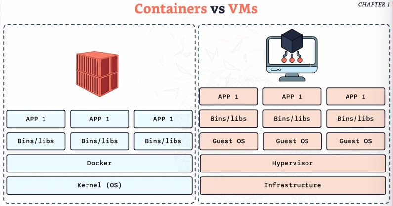

# **Containers and VMs**

**Virtual Machines (VMs)**
---
- Traditionally, applications ran inside virtual machines.

**How VMs work:**

- Each VM runs a guest OS, which runs on **virtual hardware**

- All of this is managed by the **host OS**

**Pros:**

- Strong isolation, Issues in one VM rarely affect others

**Cons:**

- Very resource-heavy, Each VM includes a full OS (often 10+ GB), Slower to start and less efficient

**Containers**
---
- Containers provide similar isolation to VMs but with much less overhead.

**Why containers are better:**

- No full guest OS per application + Shares the host OS kernel

- Faster, smaller, and more efficient, ideal for microservices and cloud environments

**How do they work?**
---
**Operating System Kernel**

- Shared by all containers on the host = Core of the operating system

**Container Runtime (Docker)**

- Manages containers - Handles communication with the **kernel and hardware**

**Binaries & Libraries**

- Each container includes its **own dependencies** which ensures consistency across environments, allowing the app to run in **complete isolation from other containers** 