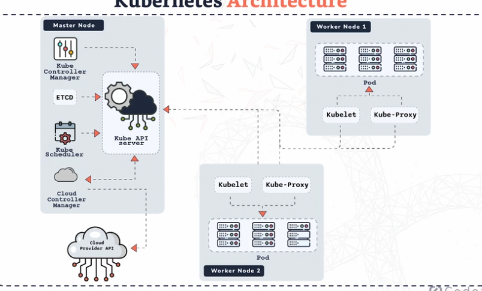

# **K8s Architecture** 

**Cluster**
---
- A cluster is a **group of nodes** that Kubernetes uses to run applications. Provides **CPU, memory, storage, and networking**

- Can run on cloud platforms like **EKS (AWS), AKS (Azure), GKE (Google)**

- Kubernetes uses the cluster’s resources to run **workloads (apps)**

- Think of a cluster as the entire system.

**Nodes (The Machines)**
---
- A node (or minion) is a single machine: can be a virtual machine or a physical server

**There are two types of nodes:**

- **Master Node (Control Plane)** → brain
- **Worker Nodes** → muscles

**The Master Node**
---
- The master node controls the entire cluster,it **does not** run your application containers. Instead, **it decides what should run and where.**

**Key Components of the Master Node** 

- **kube-api-server** - The entry point to Kubernetes = communication hub - All commands go through this (kubectl, CI/CD, etc.) - e.g. 'deploy this app'

- **etcd** - Kubernetes’ memory - Stores: **Cluster state, Configuration, What should be running and where** - If something crashes, Kubernetes checks etcd to recover.

- **kube-controller-manager** - The supervisor - Makes sure **the desired state matches the actual state** (e.g. You want 3 pods, One crashes, Controller creates a new one)

- **kube-scheduler** - Decides which worker node a new pod should run on - Considers: **Available CPU + memory and other rules (affinity, taints, etc.)**

- **cloud-controller-manager (cloud only)** - Connects Kubernetes to the cloud provider - **Manages: Load balancers, Storage volumes, Networking resources**