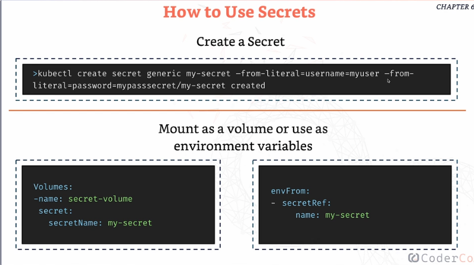

# **Secrets**

- Secrets **are designed to store sensitive data securely within your cluster.** 

- Unlike config maps, which are meant for non-confidential data, secrets keep your sensitive information out of plain sight.

- They are stored by K8s by Base64 encoding and K8s ensures that they are only used by pods an services that need them

- Just like config maps, secrets can also be **mounted as volumes or even exposed as environment variables**

- To check the secret: `kubectl get secret <secret-name> -o yaml`

- To decode the secret: `echo "encoded secret' | base64 -d`

- How to get into the container which has the secret: `kubectl exec -it <pod-name> -- /bin/sh`

- 
