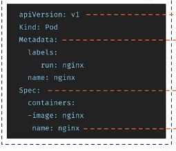

# **Pods**

- A Pod is the smallest unit in Kubernetes.

- Kubernetes does not run containers directly — it runs pods

**Key points about Pods:**
---
- A pod contains one or more containers

**All containers in a pod:**

- Are scheduled together
- Run on the same node
- Share the same IP address and port space
- Can communicate via localhost
- Containers in a pod can share storage using volumes: Storage is not automatic + Volumes must be explicitly mounted

**Why multiple containers in a Pod?**
---
**Multiple containers in a pod are used when they:**

- Need to work very closely together + Share data or networking

- Example: an app container + a logging sidecar

**How Kubernetes Creates Pods:**
---
- Kubernetes resources are created using YAML files.

- Every Kubernetes YAML file has 4 required top-level fields:

- `apiVersion:`: Defines which K8s API version to use. For pods this is: `apiVersion: v1`

- `kind:`: Defines what **object** you are creating

- `metadata:` Information about the object. Includes: name, labels, annotations, namespace

- `spec:`: Defines how the object should run, This section **differs by object type.** For a pod, it defines containers. `containers` is a list because pods can have multiple containers

- Once the YAML file is ready, create the pod with: `kubectl apply -f filename.yaml`

**Imperative Pods** 
---
- Another way to create a pod is through the command line: `kubectl run <pod name> --image=`

- e.g. `kubectl run nginx --image=nginx` 
